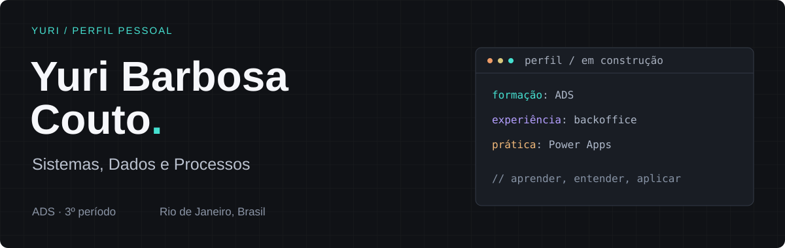
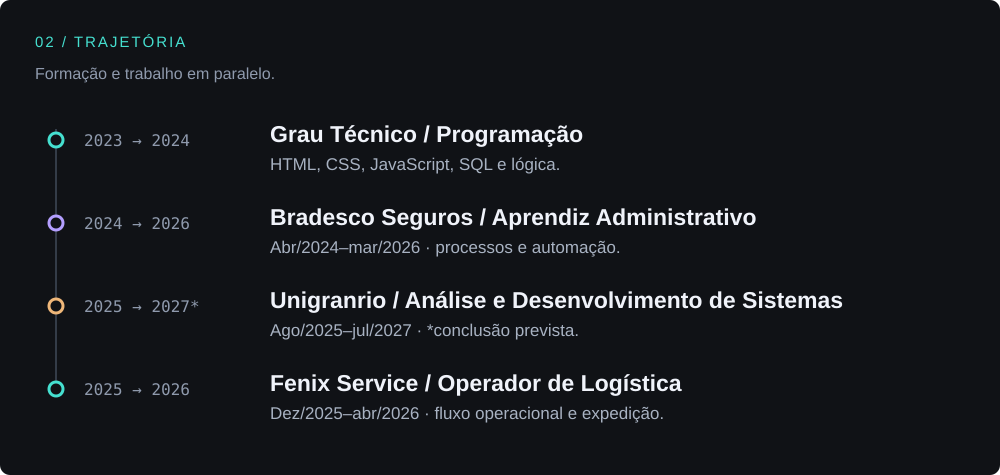

## 01 / Quem está por aqui

Sou **Yuri**, estudante do **3º período de ADS na Unigranrio | Afya**. Minha experiência com processos de uma empresa veio antes da formação em sistemas: passei dois anos no **Bradesco Seguros**, trabalhando com rotinas administrativas e criando um painel interno em **Power Apps**.

Hoje conecto essa vivência aos estudos de programação, dados e requisitos. Também trago a experiência operacional da **Fenix Service**, com organização, conferência e expedição.

 

## 03 / Na prática & em formação

<table>
<tr><th align="left">Experiência profissional</th><th align="left">Base acadêmica</th></tr>
<tr>
<td valign="top">
<strong>Processos + ferramentas</strong>  
Power Apps · Power Automate 
Excel · Microsoft Office 
Documentos · cadastros · backoffice  
Power BI: familiaridade básica no Bradesco.
</td>
<td valign="top">
<strong>Fundamentos de sistemas</strong>  
HTML · CSS · JavaScript · SQL 
Lógica · banco de dados · POO 
Requisitos · redes · segurança digital  
Conhecimentos em desenvolvimento na formação.
</td>
</tr>
</table>

## 04 / Meu próximo passo

**Entender o problema → organizar a informação → construir uma solução.**

Estou consolidando os fundamentos de programação e banco de dados, a leitura de código e a documentação. Meu interesse está em **sistemas internos, suporte, organização de dados e melhoria de processos**.

<strong>Sobre autoria e contexto dos repositórios</strong>

Este GitHub reúne estudos e experimentos. Alguns projetos tiveram apoio significativo de IA e não são apresentados como prova de implementação independente ou domínio de toda a tecnologia utilizada.

O painel em Power Apps pertence à minha experiência real no Bradesco. Código e informações internas da empresa não são publicados aqui.

---

Formação em andamento. Experiência real. Aprendizado contínuo.
